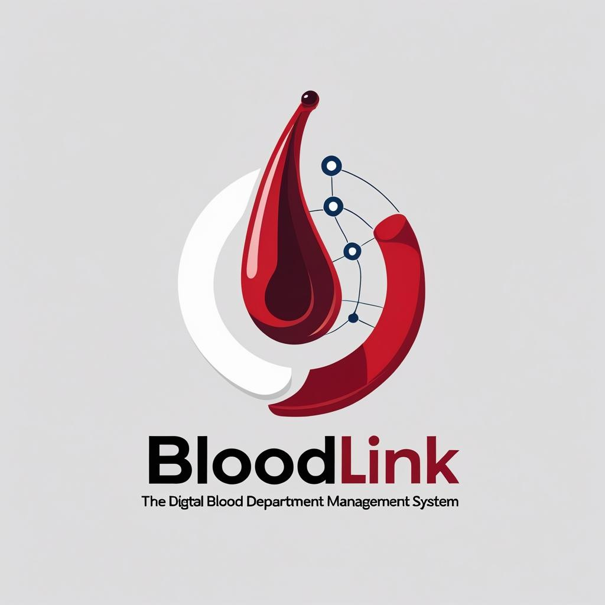

<p align="center">
  

</p>

<h1 align="center" style="color:#B22222;">BloodLink</h1>

<p align="center">
  <b>Modernizing healthcare, one click at a time.</b>
</p>

<p align="center">
  
  
  
  
</p>

---

## 🚩 Project Reflection: Inspiration & Problem Statement

> _“Every time I had to visit the hospital for routine blood tests, I had to get there as early as 7:30 AM just to stand in line. Even then, I often wouldn’t finish until the afternoon — sometimes 2 or 3 PM. Waiting in those long queues, especially when you’re not feeling well, was really exhausting and frustrating. That’s when I thought: there has to be a better way. This experience inspired me to build BloodLink, a system designed to cut down waiting times and make the whole process smoother and less stressful for patients.”_

---

## 💡 Overview

**BloodLink** is a modern healthcare management system that bridges the gap between blood donors, patients, and medical professionals with secure and efficient digital tools.  
This repository contains the **React-based frontend** for the BloodLink platform.

---

## ✨ Features

<div align="center">

| 🚑 | 🧑‍⚕️ | 🧪 | 📊 | 🔒 |
|----|-------|-----|-----|-----|
| **Digital Token Queue** | **Role-Based Dashboards** | **Lab Report Management** | **Charts & Analytics** | **Authentication** |

</div>

- **Role-Based Dashboards:** Separate dashboards for Nurses, Doctors, and Lab Technicians.
- **Patient Management:** Register, update, and manage patient records.
- **Digital Token Queue:** Manage and display patient queues for efficient flow.
- **Lab Report Management:** Add, view, and print lab reports and detailed lab results.
- **Medicine & Description Management:** Doctors can add and manage patient medicines and descriptions.
- **Account Management:** View and manage user accounts by role.
- **Responsive Design:** Optimized for desktop and mobile devices.
- **Charts & Analytics:** Visualize data with Pie, Bar, and Line charts using Recharts.
- **Authentication:** Secure login and registration for all user roles.

---

## 🗂️ Project Structure

```plaintext
src/
  component/
    dashboard/
      nurse/
      doctor/
      lab/
    style/
    assets/
    services/
  App.js
  index.js
```

- **dashboard/nurse/**: Nurse dashboard, patient registration, queue, lab reports, staff, and about pages.
- **dashboard/doctor/**: Doctor dashboard, patient details, checkup, medicine, descriptions, staff, and about pages.
- **dashboard/lab/**: Lab technician dashboard, lab report submission, details, staff, and about pages.
- **services/**: API service files for backend communication.
- **style/**, **labstyle/**, **docstyle/**: CSS files for styling components.

---

## 🚀 Getting Started

### Prerequisites

- [Node.js](https://nodejs.org/) (v16+ recommended)
- [npm](https://www.npmjs.com/) or [yarn](https://yarnpkg.com/)

### Installation

```bash
# 1. Clone the repository
git clone https://github.com/shxrox/BloodLink.git
cd BloodLine

# 2. Install dependencies
npm install
# or
yarn install

# 3. Start the development server
npm start
# or
yarn start
```

Open [http://localhost:3000](http://localhost:3000) in your browser.

### Backend

This frontend expects the backend API to be running at `http://localhost:8080`.  
See the [BloodLink-backend](../BloodLink-backend) repository for backend setup.

---

## 🧩 Key Pages & Components

- **Home:** Welcome page with patient queue and instructions.
- **Login & Registration:** Secure authentication for all roles.
- **Nurse Dashboard:** Patient registration, queue management, lab report submission, and staff management.
- **Doctor Dashboard:** Patient details, checkups, medicine management, and lab report viewing.
- **Lab Dashboard:** Lab report submission, detailed report entry, and analytics.
- **About:** Project overview, features, tech stack, and contact info.
- **Footer:** Consistent footer with contact and social links.

---

## 🎨 Customization

- **API Endpoints:** Update API URLs in the `services/` files if your backend runs on a different host/port.
- **Styling:** Modify CSS files in `style/`, `labstyle/`, and `docstyle/` for custom themes.

---

## 🤝 Contributing

Pull requests are welcome! For major changes, please open an issue first to discuss what you would like to change.

---

## 📄 Project Documentation

For a comprehensive understanding of the project's design, architecture, and implementation details, you can download the full project documentation directly from the backend repository:

[📥 Download Project Document](/DocumentAboutProject/ProjectDetails.docx)

---

## 📝 License

This project is licensed under the MIT License.

---

<p align="center">
  <br>
  <b style="color:#B22222;">BloodLink</b> – Modernizing healthcare, one click at a time.
</p>
